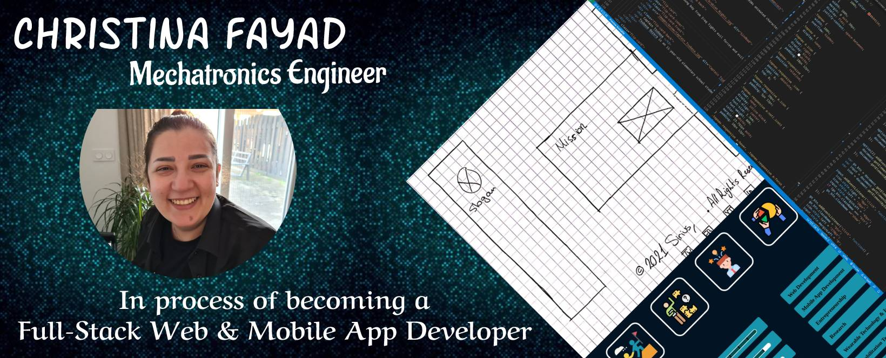

# Hey There 👋

## &#9997; Bio
My name is Christina, you can call me Chris tho &#128521;

Programing is my passion! I'm always trying to expand my knowledge & learn new languages.

Currently, I'm studying to become a Full-Stack Web Developer @[HYF](https://github.com/HackYourFuture).

Previously, I'm a MSc Mechatronics & Robotics graduate from the University of Leeds.

## 	🔭  Skills
        

       

  

   

## 👩‍💻 Had Fun Learning

| Build REST API using |  |
| -------------------- | ---------------------------------------------------------------------------------------------------------------------------- |

| Using Mongoose to manipulate |  |
| ---------------------------- | ------------------------------------------------------------------------------------------------------------------------- |

| Implement data validation using Joi |  |
| ----------------------------------- | ----------------------------------------------------------------------------------------------------------------- |

## 	🌱 Currently Learning
|  |  |  |  |  | |
|---|---|---|---|---|---|

## &#128200; GitHub Statistic

 

 

 

 

## 📫 You can reach me on
|  |  |  |  |  |  
|---|---|---|---|---|---|

 

